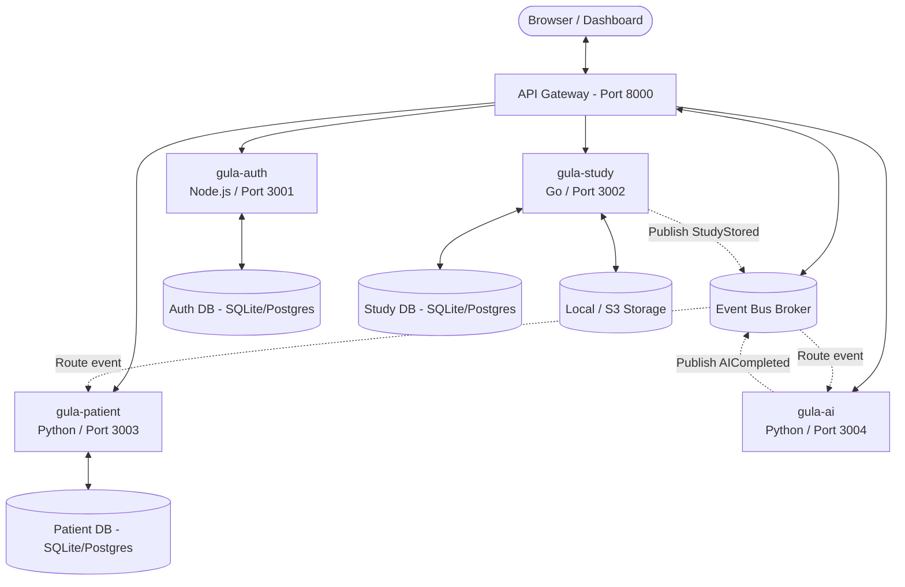

# GULA | Intelligent Healthcare Infrastructure

> "A modular, event-driven healthcare platform for intelligent clinical imaging."

GULA is designed not merely as a PACS (Picture Archiving and Communication System), but as the **operating system for clinical imaging**. By centering the platform around an Event Bus and decoupling services, GULA achieves extreme modularity, adaptability, and long-term maintainability. 

---

## 1. Core Philosophy

- **Everything is a Service**: Every component is isolated and performs a single domain task.
- **Everything communicates through Events**: Services are loosely coupled. They react to changes in system state rather than calling each other's internals.
- **Everything is API First**: Clean RESTful and web standard endpoints (DICOMweb, FHIR) expose functionalities.
- **Everything is Plugin-Based**: Hospital integrations, custom clinical viewers, and AI inference models can be installed or replaced independently.
- **Everything is Observable**: Complete metrics, logging, and distributed tracing track the journey of every scan from ingestion to reporting.
- **Multi-Tenant from Day 1**: Structured for SaaS deployments (Organization $\rightarrow$ Hospital $\rightarrow$ Department $\rightarrow$ User $\rightarrow$ Patient $\rightarrow$ Study).

### The Immutable Architectural Rule
> **"No service may directly depend on another service's implementation. Services communicate only through published APIs and domain events."**
> 
> This keeps clinical, AI, and platform roadmaps completely independent. An AI engineer never needs to modify PACS internals, and the PACS team does not need to know how a deep learning model executes inference.

---

## 2. Platform Architecture

GULA separates visualization, storage, routing, and machine learning into polyglot microservices:



### Polyglot Microservices Matrix

1. **`gula-gateway` (Python/FastAPI)**: Serves as the central reverse proxy, rate-limiter, and hosts the **WebSocket Event Bus Broker** broadcasting system events in real-time.
2. **`gula-auth` (Node.js/Express)**: Manages users, credentials, role-based access controls (RBAC), and issues secure JWT tokens. Uses SQLite (`auth.db`).
3. **`gula-study` (Go)**: A high-performance archive implementing **DICOMweb** standards. Coordinates uploads, file reads, and streams imaging frames. Uses SQLite (`study.db`) and saves raw scan binaries to `./storage/`.
4. **`gula-patient` (Python/FastAPI)**: Subscribes to the Event Bus and automatically compiles the chronological **Digital Patient Timeline** (EHR sync). Uses SQLite (`patient.db`).
5. **`gula-ai` (Python/FastAPI)**: A clinical inference operator. Subscribes to studies, loads diagnostic plugins, runs mock models, and returns structured findings.

---

## 3. The Digital Patient Timeline & Clinical Standards

GULA moves beyond basic file archiving by constructing a patient-centric, chronological clinical story:

```
[Patient Registered] ──► [Study Received] ──► [Study Stored] ──► [AI Requested] ──► [AI Completed] ──► [Report Signed]
```

### FHIR-Aligned Event Specifications
All event payloads are formatted under HL7 FHIR R4 resources:
- **`PatientCreated`**: Maps to the FHIR **Patient** schema (demographics, tenant ID).
- **`StudyReceived` / `StudyStored`**: Maps to the FHIR **ImagingStudy** schema (StudyInstanceUID, accession, series configurations, storage paths).
- **`AICompleted`**: Maps to FHIR **Observation** items containing abnormality tags, findings, and probability scores.
- **`ReportCreated` / `ReportSigned`**: Maps to the FHIR **DiagnosticReport** container (conclusions, signatures).

### DICOMweb REST API Endpoints
- **QIDO-RS (Query)**: `GET /dicomweb/studies` (Search for studies)
- **WADO-RS (Retrieve)**: `GET /dicomweb/studies/{studyUID}/series/{seriesUID}/instances/{instanceUID}/frames/{frame}` (Retrieve raw pixel frames)
- **STOW-RS (Store)**: `POST /dicomweb/studies` (Upload multipart DICOM file payload)

---

## 4. Sandbox Setup & Local Execution

GULA runs natively in a local sandbox environment using **Python 3.11+** (no Docker Desktop or external compilers required).

### Prerequisites
Make sure Python is installed and added to your system path:
```bash
python --version
```

### Starting the Platform
Launch the sandboxed microservices and event broker using the bootstrapper:
```bash
python start.py
```
This script will:
- Reset old SQLite databases and storage folders.
- Setup a Python virtual environment (`venv`) and install all required libraries (`fastapi`, `uvicorn`, `websockets`, `httpx`, `pyjwt`, `bcrypt`, `python-multipart`, `requests`).
- Launch all 5 services as concurrent subprocesses.
- Output logs to `./logs/`.

Once initialized, navigate to the Developer Portal at:
👉 **[http://localhost:8000/dashboard](http://localhost:8000/dashboard)**

### Running Integration Tests
To execute the automated pipeline checks and verify the WebSocket Event Bus trace:
```bash
.\venv\Scripts\python verify_sandbox.py
```
This runs a simulated workflow: creating a radiologist, creating a patient, uploading a dummy CT slice, and asserting that the event bus correctly triggers the AI and compiles the patient timeline.
