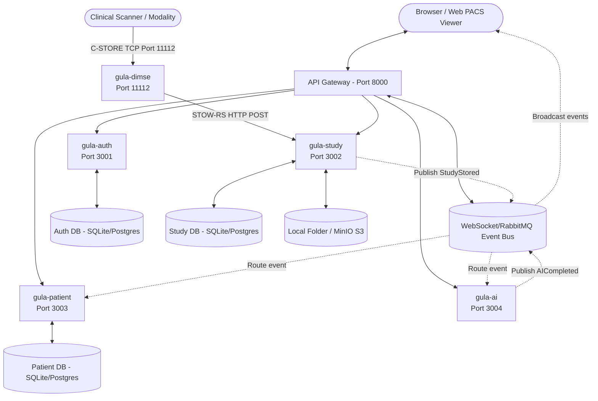

# GULA | Intelligent Healthcare Infrastructure

> "A modular, event-driven healthcare platform for intelligent clinical imaging."

GULA is designed not merely as a PACS (Picture Archiving and Communication System), but as the **operating system for clinical imaging**. By centering the platform around an Event Bus and decoupling services, GULA achieves extreme modularity, adaptability, and long-term maintainability. 

### Tribute to the Name: Gula
The platform is named in tribute to **Gula**, the ancient Mesopotamian/Babylonian goddess of healing, medicine, and doctors. Often depicted as the patron of health, restoration, and clinical well-being, she was the ultimate healer of the ancient world. 

As an event-driven operating system designed to run modern clinical imaging infrastructure, the platform carries her name as a commitment to restoring efficiency, healing technology integration bottlenecks, and supporting clinicians in their daily mission of patient care.

---

## 1. Core Philosophy

- **Everything is a Service**: Every component is isolated and performs a single domain task.
- **Everything communicates through Events**: Services are loosely coupled. They react to changes in system state rather than calling each other's internals.
- **Everything is API First**: Clean RESTful and web standard endpoints (DICOMweb, FHIR) expose functionalities.
- **Everything is Plugin-Based**: Hospital integrations, custom clinical viewers, and AI inference models can be installed or replaced independently.
- **Everything is Observable**: Complete metrics, logging, and distributed tracing track the journey of every scan from ingestion to reporting.
- **Multi-Tenant from Day 1**: Structured for SaaS deployments (Organization $\rightarrow$ Hospital $\rightarrow$ Department $\rightarrow$ User $\rightarrow$ Patient $\rightarrow$ Study).

### The Immutable Architectural Rule
> **"No service may directly depend on another service's implementation. Services communicate only through published APIs and domain events."**
> 
> This keeps clinical, AI, and platform roadmaps completely independent. An AI engineer never needs to modify PACS internals, and the PACS team does not need to know how a deep learning model executes inference.

---

## 2. Platform Architecture

GULA separates clinical visualization, DICOM ingestion, database archiving, and AI inference pipelines into polyglot microservices:



### Polyglot Microservices Matrix

1. **`gula-gateway` (FastAPI / Port 8000)**: Serves as the central reverse proxy, API gatekeeper, and hosts the bi-directional **WebSocket Event Bus Broker** broadcasting system events to clients in real-time.
2. **`gula-auth` (Node.js / Port 3001)**: Manages users, credentials, role-based access controls (RBAC), and issues secure JWT tokens. Uses SQLite (`auth.db`).
3. **`gula-study` (FastAPI / Port 3002)**: A high-performance archive implementing **DICOMweb** standards. Coordinates uploads, file reads, and streams imaging frames with support for dynamic 16-bit contrast stretching. Uses SQLite (`study.db`) and saves raw scan binaries to `./storage/`.
4. **`gula-patient` (FastAPI / Port 3003)**: Subscribes to the Event Bus and automatically compiles the chronological **Digital Patient Timeline** (EHR sync). Uses SQLite (`patient.db`).
5. **`gula-ai` (FastAPI / Port 3004)**: A clinical inference operator. Subscribes to studies, loads diagnostic plugins, runs pixel-level numpy analysis matrices, and returns structured findings.
6. **`gula-dimse` (Python / Port 11112)**: Standard **C-STORE SCP Network Listener** (AE Title: `GULA_PACS`). Receives standard raw TCP transmissions from scanners and uploads them to the core study archive.

---

## 3. Web PACS Workspace & Clinical Workflows

GULA moves beyond basic file archiving by constructing an interactive diagnostic and reporting workstation directly in the web browser.

### A. Diagnostic Web Viewer (Phase 4)
- **16-bit Server-side Windowing**: Dragging the mouse over the canvas viewport adjusts brightness/contrast. Dragging vertically modifies Window Center (WC), dragging horizontally modifies Window Width (WW), sending debounced query parameters to the WADO-RS endpoint to dynamically window-level 16-bit raw pixel arrays in python.
- **Pan & Zoom**: Scroll wheel zooms in/out centered at mouse pointer; click-and-drag pans the image.
- **Calibrated Ruler Measurement**: Draw line annotations directly on the canvas. Automatically calculates real physical distance in **millimeters (mm)** calibrated from DICOM pixel spacing metadata.

### B. Radiology Reporting Workspace (Phase 5)
- **Structured Report Templates**: Select pre-authored clinical templates (CT Brain or Chest X-Ray) that automatically inject patient metadata, study accession numbers, and active **AI diagnostics findings** into the editor.
- **Digital Signatures**: Sign off reports electronically. Finalizing submits a `ReportSigned` event to the Event Bus, locking the report as `FINAL` and logging it directly into the patient EMR timeline.
- **Clinical PDF Export**: Print or export a beautifully formatted radiology report containing demographics, AI insights, finalized conclusion text, and radiologist verification signature stamps.

### C. FHIR-Aligned Event Specifications
All event payloads are formatted under HL7 FHIR R4 resources:
- **`PatientCreated`**: Maps to the FHIR **Patient** schema (demographics, tenant ID).
- **`StudyReceived` / `StudyStored`**: Maps to the FHIR **ImagingStudy** schema (StudyInstanceUID, accession, series configurations, storage paths).
- **`AICompleted`**: Maps to FHIR **Observation** items containing abnormality tags, findings, and probability scores.
- **`ReportSigned`**: Maps to the FHIR **DiagnosticReport** container (conclusions, signatures).

---

## 4. Sandbox Setup & Local Execution

GULA runs natively in a local sandbox environment using **Python 3.11+** (no Docker Desktop or external compilers required).

### Prerequisites
Make sure Python is installed and added to your system path:
```bash
python --version
```

### Starting the Platform
Launch the sandboxed microservices and event broker using the bootstrapper:
```bash
python start.py
```
This script will:
- Reset old SQLite databases and storage folders.
- Setup a Python virtual environment (`venv`) and install all required libraries (`pynetdicom`, `pydicom`, `numpy`, `pillow`, `fastapi`, `uvicorn`, `websockets`, `httpx`, `pyjwt`, `bcrypt`, `python-multipart`, `requests`, `pika`, `psycopg2-binary`, `minio`).
- Launch all 6 microservices as concurrent subprocesses.
- Output logs to `./logs/`.

Once initialized, navigate to the Developer Portal at:
👉 **[http://localhost:8000/dashboard](http://localhost:8000/dashboard)**

---

## 5. Testing the Clinical PACS Pipeline

GULA includes interactive scratch scripts to verify the entire clinical loop from a simulated scanner to the EMR patient timeline.

1. **Simulate a DICOM Modality Upload (C-STORE SCP)**:
   In a separate terminal, run the simulated CT modality script. This generates a valid binary DICOM file, initiates a network association, and transmits it over port `11112` to `GULA_PACS`:
   ```bash
   .\venv\Scripts\python .gemini/antigravity/brain/54d7223a-b58f-4f2b-8678-67eed0b7cf94/scratch/send_test_dicom.py
   ```
   *Expected Output*: C-STORE completed successfully with status `0x0000` (Success).

2. **Simulate Patient EMR Registration**:
   Sync patient demographics for the uploaded scan by sending the EMR enrollment package to the event bus:
   ```bash
   .\venv\Scripts\python .gemini/antigravity/brain/54d7223a-b58f-4f2b-8678-67eed0b7cf94/scratch/register_dimse_patient.py
   ```

3. **Verify Interactive Viewer & Reporting Ingestion**:
   Run the verification test suite to check that server-side 16-bit WADO-RS windowing renders properly, and that final diagnostic reports compile correctly inside the patient's EMR timeline:
   ```bash
   .\venv\Scripts\python .gemini/antigravity/brain/54d7223a-b58f-4f2b-8678-67eed0b7cf94/scratch/verify_viewer_reporting.py
   ```
   *Expected Output*: Auto-contrast and Custom W/L frames return valid PNG images, and `ReportSigned` is saved successfully in the timeline history.

---

## 6. GULA Phased Development Roadmap

The platform's roadmap is structured to evolve from a lightweight clinical sandbox to a scalable enterprise imaging operating system:

| Phase | Milestone | Focus Area & Key Deliverables | Status |
| :--- | :--- | :--- | :--- |
| **Phase 0** | **Foundation** | Established architecture standards, API contracts, event schema specs, and database layout configurations. | **Completed** |
| **Phase 1** | **Core Infrastructure** | Monorepo setup, API Gateway, JWT authentication, containerized PostgreSQL, RabbitMQ, and MinIO stacks. | **Completed** |
| **Phase 2** | **Event Bus** | Defined standard event envelope formats (`PatientCreated`, `StudyReceived`, `AICompleted`, etc.) using topic routing. | **Completed** |
| **Phase 3** | **Archive** | Implemented C-STORE SCP network listener (port `11112`) and DICOMweb REST API endpoints (STOW-RS, QIDO-RS, WADO-RS). | **Completed** |
| **Phase 4** | **Diagnostic Viewer** | Render high-performance viewport canvases with server-side 16-bit windowing, pan, zoom, and mm spacing measurements. | **Completed** |
| **Phase 5** | **Reporting** | Author structured templates, digital signature sign-offs, and PDF exports for clinicians. | **Completed** |
| **Phase 6** | **AI Engine** | Package deep-learning voxel analytical pipelines (hemorrhage and pneumonia consolidation checks) using dynamic plugin loaders. | **Completed** |
| **Phase 7** | **FHIR Integration** | Synchronize clinical studies and report findings natively with external EHR/EMR platforms using standard FHIR APIs. | **Planned** |
| **Phase 8** | **Advanced Viewport** | Implement multi-planar reconstruction (MPR), 3D volume rendering, and diagnostic segmentation drawing controls. | **Planned** |
| **Phase 9** | **HL7 v2 Broker** | Build a parser for legacy HL7 messages (ADT patient demographics and ORM imaging orders) to sync legacy PACS. | **Planned** |
| **Phase 10** | **Compliance & Security**| Integrate HIPAA-compliant audit logs, end-to-end DICOM TLS data encryption, and encrypted backups. | **Planned** |
| **Phase 11** | **Marketplace Hub** | Deploy cloud-native microservice clusters, third-party model plugins, and developer integration SDKs. | **Planned** |
